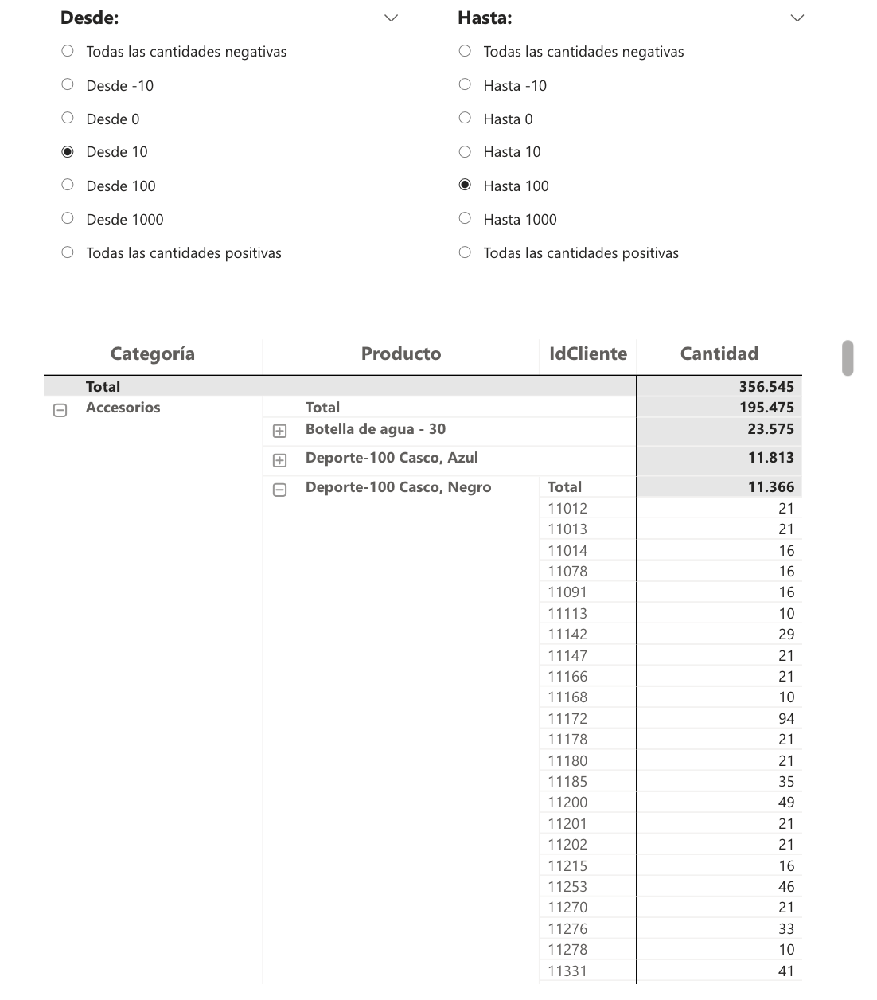

## Filtrar por rango usando un slicer

Imagina que tienes un dashboard de ventas y una matriz de productos, donde los productos están agrupados en categorías.

Tu objetivo: que el usuario pueda ver solo los productos cuya venta total esté dentro de un rango seleccionado con un slicer, sin tocar filtros manuales de Power BI.

Por ejemplo, el usuario quiere ver solo los productos que han vendido entre 500 y 1.000 unidades.

#### Paso 1: Crear tablas desconectadas para el slicer

- Tabla MinVenta: con todos los valores posibles de venta mínima

- Tabla MaxVenta: con todos los valores posibles de venta máxima

Estas tablas no están relacionadas con tu modelo. Sirven para que el usuario pueda seleccionar el rango deseado.


```
MinVenta = 
DATATABLE(
    "Cantidad", INTEGER,
    "Desde", STRING,
    "Ranking", INTEGER,
{
    {-100, "Todas las cantidades negativas", 1},
    {-10, "Desde -10", 2},
    {0, "Desde 0", 3},
    {10, "Desde 10", 4},
    {100, "Desde 100", 5},
    {1000, "Desde 1000", 6},
    {10000, "Todas las cantidades positivas", 7}
})
```

```
MaxVenta = 
DATATABLE(
    "Cantidad", INTEGER,
    "Hasta", STRING,
    "Ranking", INTEGER,
{
    {-100, "Todas las cantidades negativas", 1},
    {-10, "Hasta -10", 2},
    {0, "Hasta 0", 3},
    {10, "Hasta 10", 4},
    {100, "Hasta 100", 5},
    {1000, "Hasta 1000", 6},
    {10000, "Todas las cantidades positivas", 7}
})

```


#### Paso 2: Crear la medida de control

```
FiltrarPorVentas = 
VAR VentaMax = SELECTEDVALUE(MaxVenta[Cantidad])
VAR VentaMin = SELECTEDVALUE(MinVenta[Cantidad])

-- Calculamos la venta total por producto
VAR Producto_TotalVenta =
    CALCULATETABLE(
        SUMMARIZE(
            Ventas,
            dim_Producto[Producto],
            "TotalVenta", SUM(Ventas[Cantidades])
        ),
        -- Quitamos los filtros de producto aplicados en la matriz
        ALLSELECTED(dim_Producto[Producto])
    )

-- Filtramos solo los productos que cumplen el rango
VAR Productos_Validos =
    FILTER(
        Producto_TotalVenta,
        [TotalVenta] >= VentaMin && [TotalVenta] <= VentaMax
    )

-- Lista de productos a mostrar
VAR Lista_Productos =
    SELECTCOLUMNS(
        Productos_Validos,
        "Producto", dim_Producto[Producto]
    )

-- Asignamos 1 si el producto actual está en la lista, 0 si no
VAR Filtrado =
    IF(
        SELECTEDVALUE(dim_Producto[Producto]) IN Lista_Productos,
        1,
        0
    )

RETURN
Filtrado

```


#### Paso 3: Usar la medida como filtro en la visual

Arrastra la medida FiltrarPorVentas al panel de filtros de la visual

Selecciona mostrar solo cuando es 1

Ahora, el visual solo mostrará las categorías y productos cuya venta total esté dentro del rango seleccionado en los slicers.


* Posible mejora: tabla desconectada que permita elegir el nivel de jerarquía a filtrar:

- Nivel categoría → filtro por categoría

- Nivel producto → filtro por producto





