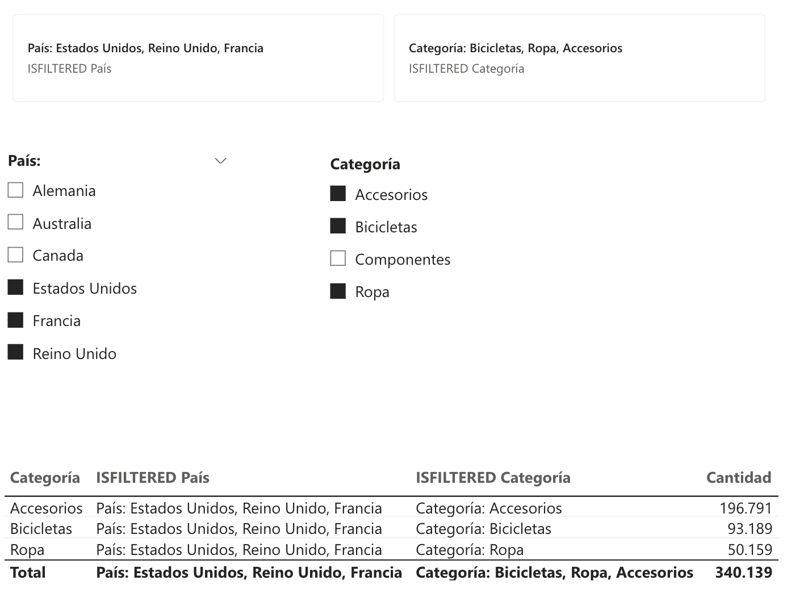

### Encabezados dinámicos con ISFILTERED 

Es muy común que un usuario filtre el informe (por país, categoría, canal, etc.) y luego se pregunte:
┬┐Esto que estoy viendo exactamente a qu├® se refiere?

Los encabezados dinámicos sirven para que el propio informe se lo explique, sin que nadie tenga que interpretarlo.

#### Problema

Imagina un dashboard de ventas que usa filtros de:

- País
- Categoría

Un director abre el informe y ve una cifra grande: Ventas = 2,3M Ôé¼.
Pregunta inmediata: ┬┐Esto es de todas las regiones o solo de alguna?

Aquí es donde entran los Encabezados dinámicos: el título del gráfico cambia automáticamente según los filtros aplicados.

#### Idea principal

- Si no hay filtro, el t├¡tulo es gen├®rico.
- Si hay filtros, el t├¡tulo dice exactamente qu├® est├í seleccionado.

```
ISFILTERED País = 
IF(
    ISFILTERED(dim_Clientes[País]),
    VAR vFiltros = FILTERS(dim_Clientes[País])
    VAR vTexto = CONCATENATEX(vFiltros, dim_Clientes[País], ", ")
    RETURN
        "País: " & vTexto
)
```

```
ISFILTERED Categoría = 
IF(
    ISFILTERED(dim_Producto[Categoría]),
    VAR vFiltros = FILTERS(dim_Producto[Categoría])
    VAR vTexto = CONCATENATEX(vFiltros, dim_Producto[Categoría], ", ")
    RETURN
        "Categoría: " & vTexto
)
```


